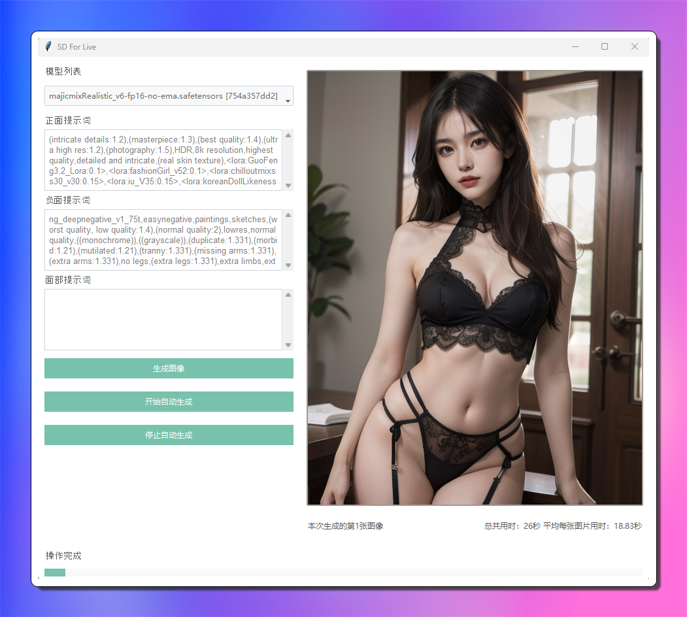

# Stable Diffusion for Live

这个项目是基于[`sdwebuiapi`](https://github.com/mix1009/sdwebuiapi)开发的，旨在使用Stable Diffusion模型自动生成AI绘图，并能够通过任意直播软件进行直播展示。

## 📷 截图


> 2023/12/21 界面

## 🌐 项目背景

Stable Diffusion是一种强大的文本到图像生成模型，通过输入描述性的文字，它能够创造出精美的图片。本项目通过一个用户友好的GUI界面简化了生成过程，并且支持将生成的图像实时展示在直播中。

## 🌟 主要特性

- **实时图像生成**: 快速生成图像并在GUI中展示。
- **直播软件兼容**: 可以与OBS、XSplit等主流直播软件配合使用。
- **个性化调整**: 支持通过正面和负面提示词来定制生成的图像风格和内容。
- **自动化流程**: 支持自动连续生成图像，适合长时间直播。
- **性能监控**: 图像生成计时及平均用时统计，帮助优化性能。

## 📦 安装

在开始之前，请确保您的系统中安装了以下组件：

- Python 3.x
- Tkinter
- PIL (Pillow)
- ttkbootstrap
- webuiapi

通过pip安装必需的Python库：

```sh
pip install pillow ttkbootstrap webuiapi
```

## ⚙️ 快速开始

1. 克隆或下载本项目的代码至您的本地计算机。
2. 在`api_test_gui.py`文件中配置您的API主机和端口，以及认证信息。
3. 启动API服务，确保其与本工具在同一网络下并且可以相互通信。
4. 运行`api_test_gui.py`：

```sh
python api_test_gui.py
```

5. 在GUI界面中填写正面和负面提示词，以指导Stable Diffusion模型生成您想要的图像。
6. 使用直播软件的窗口捕捉功能来捕获此GUI界面，即可在直播中展示图像生成过程。

## 🎥 与直播软件结合使用

为了在直播中展示AI图像生成，请按照以下步骤操作：

1. 打开您的直播软件（如OBS Studio）。
2. 创建一个新的窗口捕捉源，并选择本工具的GUI窗口。
3. 调整捕捉区域，确保只显示生成的图像和相关统计信息。
4. 启动直播后，通过本工具生成图像，观众即可实时看到生成过程。

## 📚 代码说明

- `api`: 用于与Stable Diffusion API进行通信的对象。
- `add_placeholder`: 为文本输入框添加占位文本的函数。
- `update_time_labels`: 更新界面统计信息的函数。
- `generate_image`: 根据输入的提示词生成图像的函数。
- `auto_generate_images`: 自动批量生成图像的函数（未完整显示）。

## 📝 注意

- 确保API服务正常运行，并能够响应GUI的请求。
- 部分代码内容未完全显示，请确保使用完整的`api_test_gui.py`文件。

## 🚧 更新记录

- ☑️ **增加过程进度条**
- ☑️ **自主选择模型**
- 🟩 **图像界面右侧增加过往图像**
- 🟨 **与直播界面互动**

> ☑️ `已完成` 🟩 `开发中` 🟨 `计划开发` 🟥 `停止开发`

## 🤝 贡献

欢迎通过Issue或Pull Request向本项目贡献您的智慧和建议，期待您的参与！

---

🚀 希望这个工具能为您带来直播中的创意展示和无限可能！🖌️🎨
